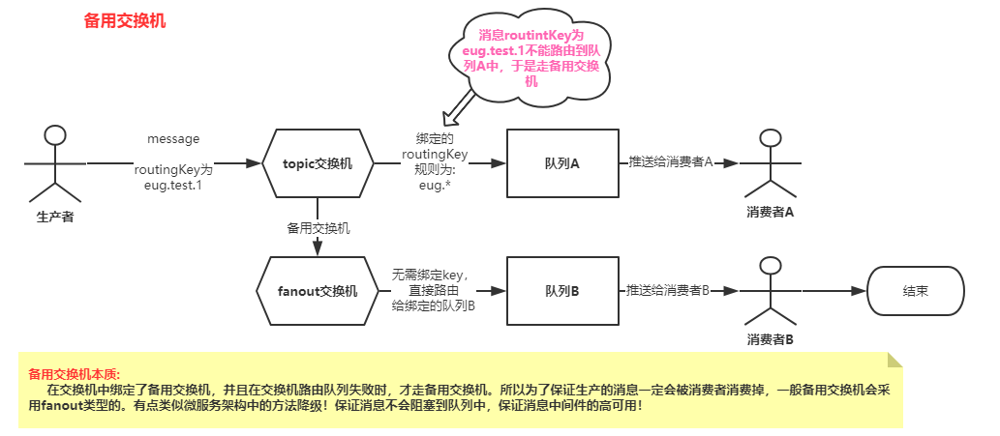
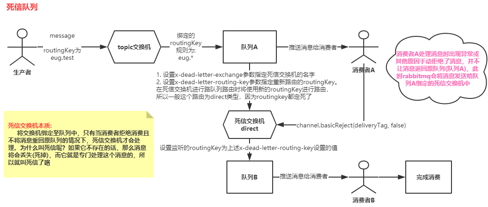

#### rabbitmq系列, 从初识到实战

## 一、rabbitmq安装
* 采用的docker化安装，参照官网提供的如下命令:

  ```shell
  # 使用的是3.x版本的rabbitmq
  docker run -it -d --name rabbitmq -p 5672:5672 -p 15672:15672 rabbitmq:3-management
  ```

## 二、Exchange类型

### 2.1默认Exchange

* 默认的Exchange为`Direct`，当我们不显示指定**exchange**, 通常会使用rabbitmq默认的**exchange**，名字叫**amq.gen.xxxxxxxxxxxx**, 类型为**Direct**。 我们可能很疑惑，**Direct**不是需要指定`Routing key`吗？是的，我们需要指定**队列的名字**为`Routing key`。 所以默认的**exchange**需要我们把队列名字和`Routing key`起相同的名字，才能被绑定队列中的消费者进行消费

### 2.2 Direct

* 上面说了，rabbitmq默认的exchange就是Direct。**Direct**的特点就是只将消息生产至与exchange绑定的队列中。即需要使用`channel.queueBind`方法将队列和key进行绑定。当生产者发布了对应key的消息的时候，就会把消息生产至队列中去

### 2.3 Fanout

* fanout指定只要队列与Exchange绑定了，在生产消息的时候就会往所有绑定的队列中生产

### 2.4 Topic

* topic是Direct的升级版，支持了模糊匹配。匹配符为`#`和`*`。 `#`代表多个，`*`代表一个。比如有两个队列绑定了topic的exchange。其中队列1绑定的Routing key为`eug.test.#`. 队列2绑定的Routing key为`eug.test.*`。

  那么假设，生产者生产了两条消息，Routing key分别为: `eug.test.1.2`和`eug.test.1`。那么队列1中可以添加`eug.test.1.2`和`eug.test.1`这两个消息。而队列2只能添加`eug.test.1`消息

### 2.5 注意

* 所有的`Routing Key`必须要使用`.`隔开。是RabbitMQ的规范。

## 三、Spring Boot集成RabbitMQ流程

### 3.1 新建连接bean

* 新建`org.springframework.amqp.rabbit.connection.ConnectionFactory`bean

  ```java
  @Bean
  public ConnectionFactory connectionFactory() {
      CachingConnectionFactory cachingConnectionFactory = new CachingConnectionFactory();
      cachingConnectionFactory.setVirtualHost("/eugene");
      cachingConnectionFactory.setUsername("guest");
      cachingConnectionFactory.setPassword("guest");
      cachingConnectionFactory.setHost("192.168.111.145");
      cachingConnectionFactory.setPublisherConfirms(true);
      return cachingConnectionFactory;
  }
  ```

### 3.2 RabbitTemplate

* 在springboot集成RabbitMQ的过程中，**RabbitTemplate**的主要作用就是和RabbitMQ链接，后续将使用它来发送消息。具体语法如下:

  ```java
  rabbitTemplate.convertAndSend("topic名字", "routingKey", "传递的消息");
  // 通过这行代码，rabbitTemplate就能知道将消息发送到哪个交换机上，然后交换机就能根据自己的特性，将routingKey将消息发送给符合条件的队列
  ```
  
* `RabbitTemplate`bean定义如下

  ```java
  @Bean
  public RabbitTemplate rabbitTemplate() {
      RabbitTemplate rabbitTemplate = new RabbitTemplate(connectionFactory());
      // 将消息发送给RabbitMQ的回调
      rabbitTemplate.setConfirmCallback((correlationData, ack, cause) -> {
          // 第一个参数: 是生产消息是传入的CorrelationData对象，里面维护了一个id，
          // 可以自定义取值来标识某些业务
          // 第二个参数: 判断消息有没有发成功
          // 第三个参数: 发生异常的原因，cause为异常的原因
          System.out.println("ack: " + ack);
          System.out.println("cause: " + cause);
          System.out.println("correlationData: " + correlationData);
      });
  
      // 允许失败回调
      rabbitTemplate.setMandatory(true);
      // 当消息服务器将消息发送给队列中时的回调
      rabbitTemplate.setReturnCallback((message, replyCode, replyText, exchange, routingKey) -> {
          // 第一个参数: message -> 消息主体
          // 第二个参数: 发送失败错误码
          // 第三个参数: 发送失败错误信息
          // 第四个参数: 发送的交换机名字
          // 第五个参数: 发送消息的routingKey
          System.out.println(message);
          System.out.println(replyCode);
          System.out.println(replyText);
          System.out.println(exchange);
          System.out.println(routingKey);
      });
  
      // 自己实现了一个消息转换器
      rabbitTemplate.setMessageConverter(new MessageConverter() {
          @Override
          public Message toMessage(Object object, MessageProperties messageProperties) throws MessageConversionException {
              // 指定发送的消息类型为test/plain
              messageProperties.setContentType("text/plain");
              // 指定消息的编码格式
              messageProperties.setContentEncoding("UTF-8");
              Message message = new Message(JSON.toJSONBytes(object), messageProperties);
              return message;
          }
  
          @Override
          public Object fromMessage(Message message) throws MessageConversionException {
              return message;
          }
      });
  
      return rabbitTemplate;
  }
  ```

### 3.3 创建队列 queue

* 直接创建一个`org.springframework.amqp.core.Queue`类型的bean即可

  ```java
  @Bean
  public Queue preFetchQueue() {
      return QueueBuilder.durable(Constants.PRE_FETCH_QUEUE_NAME).build();
  }
  ```

### 3.4 创建交换机exchange

* 直接创建一个对应类型的exchange即可。

  ```txt
  eg: spring-amqp jar包中包含了如下exchange:
  1. org.springframework.amqp.core.TopicExchange
  2. org.springframework.amqp.core.DirectExchange
  3. org.springframework.amqp.core.FanoutExchange
  4. org.springframework.amqp.core.HeadersExchange
  ```

  或者使用`ExchangeBuilder`也可以创建一个exchange，采用build语法, 如下:

  ```java
  (TopicExchange) ExchangeBuilder.topicExchange("topicExchangeName").withArgument("参数key", "value").build();
  ```

### 3.5将绑定交换机、队列和routing key

* 使用提供的`Binding`对象即可，如下:

  ```java
  BindingBuilder.bind(绑定的队列).to(交换机).with(绑定的key);
  // 大致的语法就是将队列绑定到交换机中并监听具体的key
  ```

### 3.6使用@RabbitListener指定消费者手动确认消息

* 注解添加listenter参数，eg如下:

  ```java
  /**
   * messageErrorHandler为一个实现了RabbitListenerErrorHandler接口的消息发生异常的处理器的名字(是一个bean)
   * simpleRabbitListenerContainerFactory是一个实现了RabbitListenerContainerFactory接口的消费者容器工厂
   * (它是一个bean，并且内部设置了消息确认模式为手动)
  **/
  @RabbitListener(
      queues = Constants.ORDER_QUEUE_NAME,
      errorHandler = "messageErrorHandler",
      containerFactory = "simpleRabbitListenerContainerFactory"
  )	
  ```

* name为**messageErrorHandler**的bean

  ```java
  @Component
  public class MessageErrorHandler implements RabbitListenerErrorHandler {
  
      private static final Logger logger = LoggerFactory.getLogger(MessageErrorHandler.class);
  
      @Override
      public Object handleError(Message amqpMessage, org.springframework.messaging.Message<?> message, ListenerExecutionFailedException exception) throws Exception {
          logger.warn("处理消息异常, 异常消息为: {}, 异常信息为: ", amqpMessage, exception);
          logger.info("可以在此处对消息进行持久化存入db，并使用job定时去消费");
  
          return null;
      }
  }
  ```

* name为**simpleRabbitListenerContainerFactory**的bean

  ```java
  @Bean
  public SimpleRabbitListenerContainerFactory simpleRabbitListenerContainerFactory() {
      SimpleRabbitListenerContainerFactory factory = new SimpleRabbitListenerContainerFactory();
      factory.setConnectionFactory(connectionFactory());
      factory.setAcknowledgeMode(AcknowledgeMode.MANUAL);
      return factory;
  }
  ```

### 3.7 注意事项

* rabbitTemplate能够直接与rabbit服务端进行交互，直接使用**convertAndSend**方法就能实现消息发送

* 使用`@RabbitListener`注解即可实现消息消费，但要指定消费的队列。

  ```txt
  这里有点想吐槽，它的@RabbitListener注解压根没有@Inherited修饰，都无法对它进行扩展。
  ```
  
* 若消费者在消费消息的时候，并未手动确认或者拒绝消息，那么这条消息就会一直在`unacked`状态。要么消费者确认消息完成消费，要么消费者拒绝消息让消息回到队列，或者消费者与rabbitmq断开链接后消息自动回到队列

## 四、引入消息中间件可能出现的问题

### 4.1 发送消息时，消息中间件挂了，导致消息没有正常发送

* 有可能用户在下单完成后，触发了发送消息的步骤。但是有可能在刚好发消息的时候，消息中间件挂了，导致消息没有发送出去

* 可能出现的问题方向：

  1. 要确认消息发送到交换机 过程中失败(eg: 消息发送的过程中，项目挂了或者rabbitmq挂了)
  2. 交换机将消息发送至队列 过程中失败(eg: message对应的key没有队列能绑定)

* 解决方案: 

  1. 针对方向1：在将消息发送至交换机时，RabbitMQ会进行一次回调  ---- `发送方确认`
  2. 针对方向2：在交换机将消息推送给队列失败时，RabbitMQ也会进行回调  ---- `失败回调`

* 实践: 

  1. 针对方向1：

     ```txt
     1. 连接工厂要开启发送方确认模式: cachingConnectionFactory.setPublisherConfirms(true)
     2. rabbitmqTemplate提供发送消息的回调: 
     	rabbitTemplate.setConfirmCallback((correlationData, ack, cause) -> {
             // 第一个参数: 是生产消息是传入的CorrelationData对象，里面维护了一个id，可以自定义取值来标识某些业务
             // 第二个参数: 判断消息有没有发成功
             // 第三个参数: 发生异常的原因，cause为异常的原因
             System.out.println("123");
         });
     ```

  2. 针对方向2:

     ```txt
     1. 同上，需要设置发送方确认模式
     2. 设置允许失败回调: rabbitTemplate.setMandatory(true);
     3. 设置失败回调函数:
         rabbitTemplate.setReturnCallback((message, replyCode, replyText, exchange, routingKey) -> {
             // 第一个参数: message -> 消息主体
             // 第二个参数:
             // 第三个参数:
             // 第四个参数: 发送的交换机名字
             // 第五个参数: 发送消息的routingKey
             System.out.println(message);
             System.out.println(replyCode);
             System.out.println(replyText);
             System.out.println(exchange);
             System.out.println(routingKey);
         });
     ```

* 综上所述，一个消息发生成功需要这两个回调中都没发生异常(发送成功的情况下，第二个方向中的回调不会进入)

### 4.2 spring-amqp中自带的消息转换器

* 在`spring-amqp`中，spring会使用反射调用@RabbitListener注解标识的方法。当我们的参数中存在一个String类型的参数时，spring会认为这是想要注入的消息内容。最后会自己执行一套逻辑来注入这个参数(**使用消息转换器**)，具体逻辑如下: 

  ```java
  // SimpleMessageConverter.java
  public Object fromMessage(Message message) throws MessageConversionException {
      Object content = null;
      // 拿到消息的MessageProperties对象
      MessageProperties properties = message.getMessageProperties();
      if (properties != null) {
          String contentType = properties.getContentType();
          // 判断消息的ContentType类型是否为text打头，eg: text/html, text/xml等等
          if (contentType != null && contentType.startsWith("text")) {
              // 拿到消息内部的编码格式，我们可以指定格式。eg: UTF-8, GBK等等
              String encoding = properties.getContentEncoding();
              if (encoding == null) {
                  // 默认为utf-8
                  encoding = this.defaultCharset;
              }
              try {
                  // 最终使用编码格式进行编码
                  content = new String(message.getBody(), encoding);
              }
              catch (UnsupportedEncodingException e) {
                  throw new MessageConversionException(
                      "failed to convert text-based Message content", e);
              }
          }
          else if (contentType != null &&
                   contentType.equals(MessageProperties.CONTENT_TYPE_SERIALIZED_OBJECT)) {
              try {
                  content = SerializationUtils.deserialize(
                      createObjectInputStream(new ByteArrayInputStream(message.getBody()), this.codebaseUrl));
              }
              catch (IOException | IllegalArgumentException | IllegalStateException e) {
                  throw new MessageConversionException(
                      "failed to convert serialized Message content", e);
              }
          }
      }
      if (content == null) {
          content = message.getBody();
      }
      return content;
  }
  ```

* 通过看了部分源码，大致知道了spring在消费rabbitmq消息时的处理，可以在rabbitmqTemplate中添加指定的消息转换器，其中包含，发送消息时的转换器回调以及接收消息时的转换器回调

### 4.3 备用交换机(解决交换机路由队列失败而衍生的交换机)

* 一个消息发送失败的原因可以是**未将消息发送至交换机**、**交换机未绑定队列或者路由失败**

  对应的场景就是: 

  ```txt
  1. 发送消息时rabbitmq挂了或者自己的应用程序挂了，导致消息发送失败
  2. 发送消息时指定的交换机路由指定key时失败，即与指定交换机绑定的队列中不支持指定key
  ```

* 为了解决消息发送的成功率，可以添加一个类型为**fanout**备用交换机, 并且将之与指定队列绑定。这样的话就基本上能保证消息发送的成功率了。模型大概就是: **两个交换机绑定同一个队列，消费者消费队列的消息**

* 具体代码如下:

  ```java
  @Bean
  public TopicExchange topicExchange() {
      Map<String, Object> map = new HashMap<>();
      map.put("alternate-exchange", "defaultExchange");
      return (TopicExchange) ExchangeBuilder.topicExchange(Constants.TOPIC_EXCHANGE).withArguments(map).build();
  }
  
  @Bean(Constants.ORDER_QUEUE_NAME)
  public Queue queue() {
      return new Queue(Constants.ORDER_QUEUE_NAME);
  }
  
  @Bean
  public Binding binding() {
      // 将队列和routing key绑定至exchange中, RoutingKey为: order.#
      return BindingBuilder.bind(queue()).to(topicExchange()).with(Constants.ORDER_SERVICE_MATCH_PREFIX_ROUTING_KEY);
  }
  
  @Bean
  public FanoutExchange defaultExchange() {
      return (FanoutExchange) ExchangeBuilder.fanoutExchange(Constants.DEFAULT_EXCHANGE).build();
  }
  
  @Bean
  public Binding defaultExchangeBinding() {
      return BindingBuilder.bind(queue()).to(defaultExchange());
  }
  ```

  当使用如下代码

  ```java
  // routingKey为123order.create
  rabbitTemplate.convertAndSend(Constants.TOPIC_EXCHANGE, 123 + Constants.ORDER_CREATE_ROUTING_KEY, JSON.toJSONString(map), correlationData);
  ```

  消息会发送成功，但是是通过默认的`fanout`交换机发送成功了。

* 注意: 若交换机已存在且修改了它的属性，会报如下错误:

  ```java
  reply-code=406, reply-text=PRECONDITION_FAILED - inequivalent arg 'alternate-exchange' for exchange 'topicExchange' in vhost '/eugene': received the value 'defaultExchange' of type 'longstr' but current is none, class-id=40, method-id=10
  ```

  解决方案是: 将交换机删掉，或者重新新建一个新的

  其他注意事项:

  1. 使用备用交换机的话，在rabbitTemplate中配置的两个失败回调要主交换机和备用交换机都失败后才会回调。

* 备用交换机原理:

  

  ---

## 五、消息预取

### 5.1  背景

* 为什么需要消息预取？

  ```txt
  对于Rabbitmq，它发送消息的机制为轮询，且一次性全部发完。如果消息量比极少还没关系，若消息量非常多，那么客户端可能扛不住。于是，我们期望rabbit在往消费者发送消息时，等消息消费完了再发送下一波。这就是消息预
  ```

### 5.2 如何实现

* 步骤

  ```txt
  客户端在channel中设置如下配置: channel.basicQos(1);
  表示rabbitmq中一次只往消费者客户端发送1条消息，待消息确认消费完后再发送第二条
  所以推送多少条消息由消费者来决定
  
  --> 所以会存在这样的一个定律:
    性能越高的消费者，预取的消息越多，可靠性就越低
    
    但预取的数量有上限，最高2500.再往上走，性能也不会提高。
    中间值为500. 这样的话，性能和可靠性基本上持平
  ```

  `注意:使用消息预取功能的话，我们必须要将消息确认模式为手动确认`

* 带来的问题(消息可靠性和幂等性):

  ```txt
  假设某个消费者预取了20条消息，在执行19条消息的时候，消费者挂了。此时这20条消息会重回队列进入 ready 状态。这样的话，可能会存在消息重复消费的问题(因为是预取，所以会采用批量确认消息机制，即当20条消息都完成了才进行确认消息操作)。
  所以存在消息幂等问题, 如何解决呢？
  => 每次消费的时候，若消费完成就使用往redis中key对应为rabbitMq的set数据结构中添加当前消息对应的deliveryId
  因为set的唯一特性，当set成功则表示消费完成，若set失败，则表示此消息已经被消费完成了。最后再使用定时任务在某一个时间点同步redis中的数据至db中
  ```

* 消息预取与幂等性实战:

  ```txt
  参考message-pre-fetch分支的代码，可以查看GoodsController.java和OrderController.java类中的代码实现。
  解决思路大概如下:
     1. 每次消费时，判断业务唯一ID是否存在于set数据结构中，若存在则为重复消费，否则为正常消费
     2. 将消费过的消息的业务唯一ID存入redis的set数据结构中
     3. 消费成功的消息则手动确认，否则拒绝消费。若系统可接受对消息的丢弃则可以直接拒绝消费且不入队列，若消息不可接受消息的丢弃，则可以利用死信队列机制
  ```

## 六、死信队列(解决接收消费者拒绝消息但不返回原队列的操作)

* 死信队列的存在就是保证消息不丢失。在我们消费消息时，我们可以拒绝消息，其中可以设置是否将消息重返队列。若设置不返回队列，此消息将被`丢弃`。为了保证消息不丢弃，我们可以采用死信队列的方式，在拒绝消费消息且不让消息回队列的情况下，可以设置一个死信队列，rabbitmq会专门接收这种特性的消息。

* 实现步骤:

  ```txt
  1. 为队列绑定一个死信交换机
  2. 为死信交换机绑定一个队列B
  3. 将队列B和死信交换机绑定起来
  4. 设置消费者监听队列B信息
  ```

* 死信队列原理图:

  